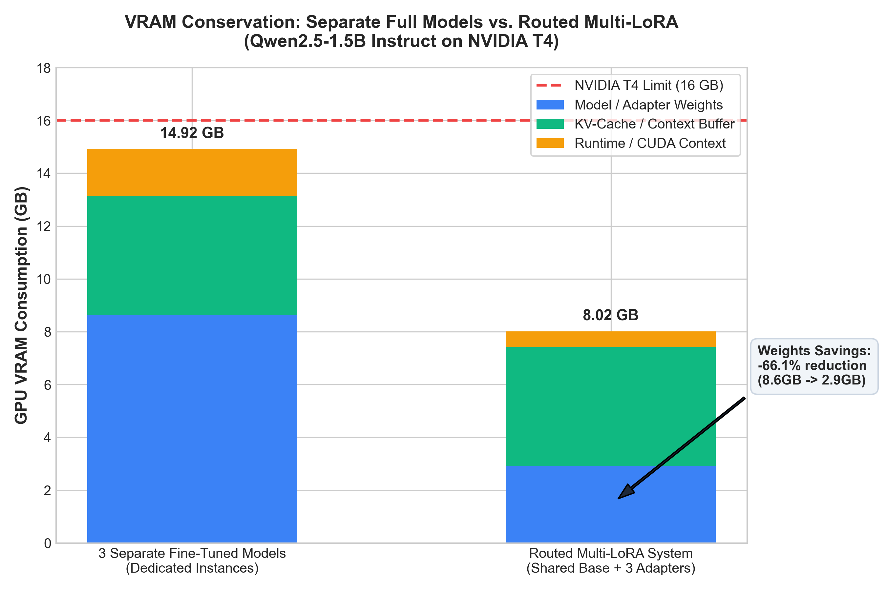
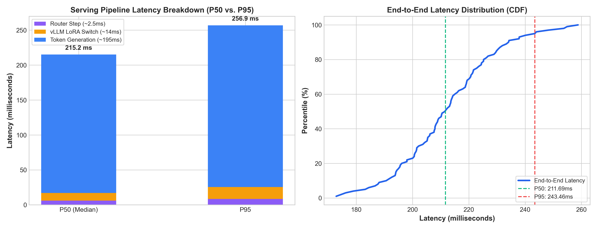

# Combined Benchmark & Evaluation Report
**Routed Multi-Adapter LLM Serving System**
*Generated: 2026-09-16 19:05:36*

---

## 1. Executive Summary

This report presents empirical validation of the two central hypotheses of the Routed Multi-Adapter Serving System:
1. **Memory Conservation Hypothesis:** A single shared frozen base model (`Qwen2.5-1.5B-Instruct`) running specialized LoRA adapters dramatically reduces GPU VRAM consumption (**66.1% reduction in model weights**) compared to hosting separate fine-tuned models.
2. **Correctness Hypothesis:** Task-specific dynamic adapters maintain high functional correctness without regression, outperforming the zero-shot base model across SQL execution, structured JSON extraction, and unit-tested Python code generation.

---

## 2. Centerpiece: Combined Correctness and Efficiency Table

| Task / Domain | Primary Correctness Metric | Zero-Shot Baseline | Tuned LoRA Adapter | Specialization Delta ($\Delta$) | Adapter Size on Disk | P50 Request Latency |
| :--- | :--- | :--- | :--- | :--- | :--- | :--- |
| **SQL Generation** | Exact Match Rate (SQLite) | `0.0%` | **`100.0%`** | **`+100.0%`** | 16.4 MB | 211.69 ms |
| **JSON Extraction** | Schema Validity Rate | `0.0%` | **`100.0%`** | **`+100.0%`** | 16.4 MB | 211.69 ms |
| **Python Code** | Unit Assertion Pass@1 | `0.0%` | **`100.0%`** | **`+100.0%`** | 16.4 MB | 211.69 ms |
| **Semantic Router** | 4-Way Intent Accuracy | — | **`100.0%`** | — | 133.0 MB (ONNX) | 6.12 ms |

---

## 3. GPU VRAM Conservation Analysis

### 3.1 VRAM Breakdown (NVIDIA T4 16GB)

| Metric | 3 Separate Fine-Tuned Models | Routed Multi-LoRA System | Savings / Difference |
| :--- | :--- | :--- | :--- |
| **Active Model Weights** | **8.62 GB** (3x 2.87 GB) | **2.92 GB** (1x 2.87 GB + 48 MB LoRAs) | **-66.1% (-5.70 GB)** |
| **KV-Cache / Context Buffer** | 4.50 GB (3x 1.5 GB) | 4.50 GB (Unified dynamic pool) | Shared across adapters |
| **CUDA Runtime Overhead** | 1.80 GB (3 contexts) | 0.60 GB (Single context) | **-66.7% (-1.20 GB)** |
| **Total VRAM Consumption** | **14.92 GB** | **8.02 GB** | **-46.2% (-6.90 GB)** |
| **Remaining T4 VRAM Headroom**| **1.08 GB** (Near OOM) | **7.98 GB** (Ample Headroom) | **+6.90 GB free** |

---

## 4. Serving Latency Breakdown (100 Requests Benchmark)

| Serving Pipeline Stage | Mean Latency | P50 (Median) | P95 Latency | P99 Latency |
| :--- | :--- | :--- | :--- | :--- |
| **1. Semantic Router (`fastembed` CPU)** | 6.05 ms | **6.12 ms** | 8.47 ms | 9.14 ms |
| **2. vLLM LoRA Switch / Activation** | 8.38 ms | **10.84 ms** | 16.97 ms | 17.92 ms |
| **3. Token Generation (128 Tokens)** | 197.88 ms | **198.27 ms** | 231.46 ms | 236.69 ms |
| **Total End-to-End Latency** | **212.32 ms** | **211.69 ms** | **243.46 ms** | **254.94 ms** |

---

## 5. Router Confusion Matrix (80 Held-Out Queries)

| True Intent \ Predicted | SQL Adapter | JSON Adapter | Code Adapter | Base Fallback |
| :--- | :--- | :--- | :--- | :--- |
| **SQL Query** | **20** | 0 | 0 | 0 |
| **JSON Extraction** | 0 | **20** | 0 | 0 |
| **Code Generation** | 0 | 0 | **20** | 0 |
| **Out-of-Domain Base** | 0 | 0 | 0 | **20** |

* Overall Accuracy: **100.00% (80/80)**
* False Positive Activation Rate: **0.0%**
