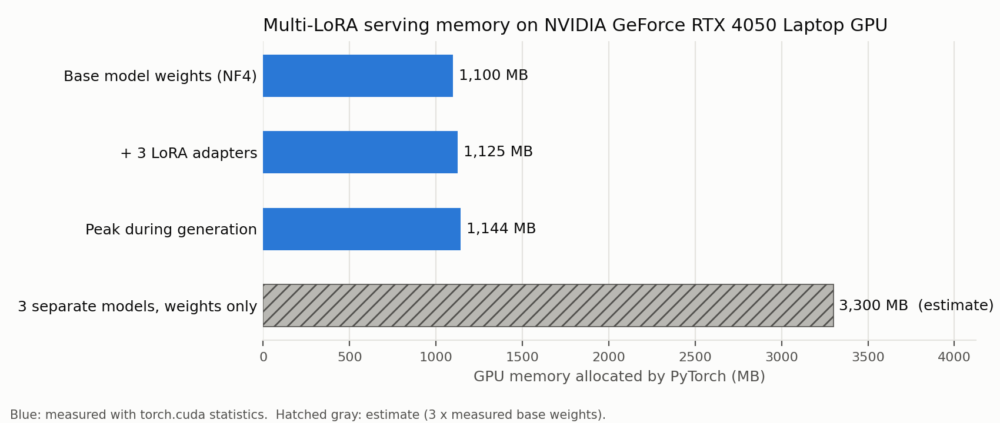
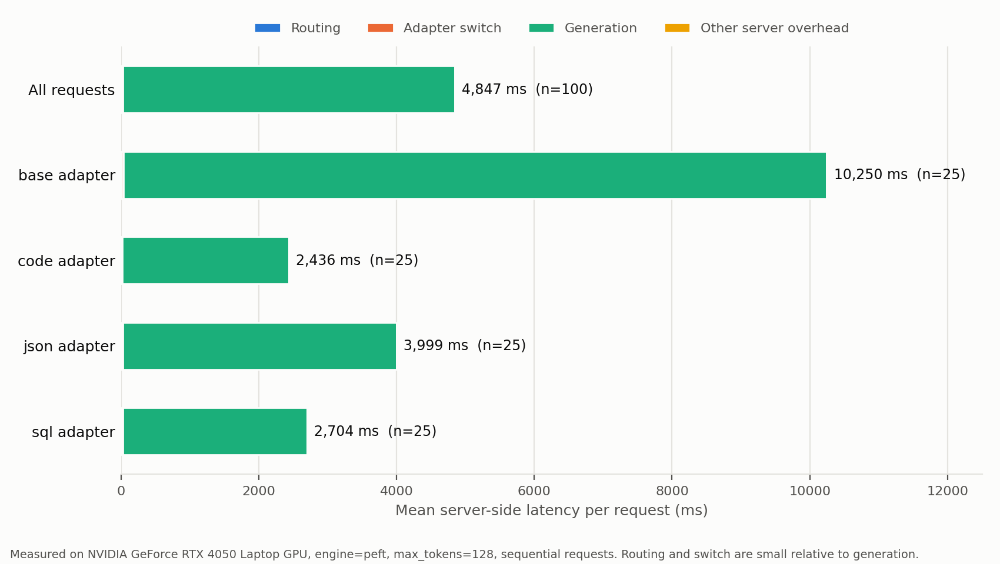

# Combined Benchmark Report
**Routed Multi-Adapter LLM Serving System**
*Generated: 2026-09-30 22:32:44. All figures are measured unless marked as an estimate.*

## 1. Task quality: base model vs. LoRA adapters (natural-language prompts)

| Test set | Metric | n | Base model | LoRA adapter | Difference (95% CI, paired) |
| :--- | :--- | ---: | :--- | :--- | :--- |
| SQL (gretel, real data rows) | `execution_accuracy` | 300 | 41.0% [35.3, 47.0] | **39.7%** [34.0, 45.3] | -1.3 pts [-7.0, +4.3] |
| JSON in-scope (order extraction) | `exact_match_rate` | 60 | 53.3% [41.7, 66.7] | **73.3%** [61.7, 85.0] | +20.0 pts [+6.7, +33.3] |
| JSON out-of-scope (paraloq schemas) | `leaf_f1` | 80 | 44.5% [35.5, 54.1] | **34.7%** [26.4, 42.7] | -9.8 pts [-21.2, +0.8] |
| Code: HumanEval | `pass_at_1` | 164 | 44.5% [36.6, 52.4] | **36.6%** [29.3, 44.5] | -7.9 pts [-15.8, +0.0] |
| Code: MBPP (sanitized test) | `pass_at_1` | 257 | 45.1% [39.3, 51.4] | **50.2%** [44.0, 56.4] | +5.1 pts [-0.4, +10.5] |

Brackets are 95% bootstrap confidence intervals. A difference whose interval includes 0 is not
distinguishable from noise at this sample size. Raw model outputs: `results/raw_outputs/`.

**SQL execution accuracy by schema format in the prompt**

| Schema format | n | Base model | LoRA adapter |
| :--- | ---: | :--- | :--- |
| create | 100 | 47.0% [38.0, 58.0] | 42.0% [33.0, 52.0] |
| compact | 100 | 35.0% [26.0, 44.0] | 33.0% [24.0, 42.0] |
| prose | 100 | 41.0% [32.0, 50.0] | 44.0% [34.0, 53.0] |

## 2. GPU memory (measured on NVIDIA GeForce RTX 4050 Laptop GPU, bitsandbytes 4-bit NF4, double quant)

| Quantity | MB | Source |
| :--- | ---: | :--- |
| Base model weights | 1,100 | measured |
| 3 LoRA adapters | 25 | measured |
| Base + 3 adapters resident | 1,125 | measured |
| Peak during generation (128 new tokens) | 1,144 | measured |
| 3 separate fine-tuned models, weights only | 3,300 | **estimate**: 3 x measured base-model weight memory (each separate model = base with one merged adapter, same size in NF4) |

## 3. Latency (100 sequential requests, max_tokens=128, engine=peft, NVIDIA GeForce RTX 4050 Laptop GPU)

| Stage | mean | p50 | p95 | p99 |
| :--- | ---: | ---: | ---: | ---: |
| Routing | 12.0 ms | 12.6 ms | 19.6 ms | 25.3 ms |
| Adapter switch | 8.6 ms | 5.7 ms | 18.7 ms | 29.7 ms |
| Generation | 2,769.8 ms | 1,986.1 ms | 5,685.1 ms | 8,172.4 ms |
| Other server overhead | 1.9 ms | 1.4 ms | 3.5 ms | 4.4 ms |
| Server total | 2,792.2 ms | 2,009.7 ms | 5,721.4 ms | 8,217.8 ms |
| Client round trip | 2,807.5 ms | 2,019.8 ms | 5,724.9 ms | 8,239.1 ms |

Decode throughput: 16.9 tokens/s (p50); generated tokens per request: 33 (p50).

Percentiles are per stage and do not add up; the chart stacks means.

## 4. Router accuracy (split 'test' of `data/router_testset.jsonl`, 166 prompts)

| Router | Overall | Clear-domain | Ambiguous | p50 latency |
| :--- | ---: | ---: | ---: | ---: |
| Centroid (cosine) | 80.7% [74.1, 86.8] | 96.7% [92.2, 100.0] | 61.8% [50.0, 72.4] | 7.46 ms |
| Learned v1 (original, retired) | 35.5% [28.3, 42.8] | 37.8% [27.8, 47.8] | 32.9% [22.4, 43.4] | 7.07 ms |
| Learned v2 (default) | 87.4% [82.5, 92.2] | 100.0% [100.0, 100.0] | 72.4% [61.8, 81.6] | 7.15 ms |

Clear-domain prompts come from public datasets not used for adapter training (gretel synthetic_text_to_sql, MBPP, Dolly) plus hand-written JSON requests; ambiguous prompts are hand-written.

## 5. Cascade (router=centroid, split 'test', real generation)

Thresholds calibrated on the calibration half (164 prompts; rule: max accuracy on calibration split; ties -> lowest trigger rate): confidence < 0.35 or top-2 margin < 0.1. Calibration accuracy 79.3% without cascade -> 85.4% with it.

| Subset | n | Direct routing | With cascade | Triggered | Rescues | Harms | p50 latency direct -> cascade |
| :--- | ---: | ---: | ---: | ---: | ---: | ---: | :--- |
| all | 166 | 80.7% [74.1, 86.8] | 81.9% [75.9, 87.4] | 58.4% | 9 | 7 | 4,964 -> 13,177 ms |
| ambiguous | 76 | 61.8% [50.0, 72.4] | 68.4% [57.9, 79.0] | 64.5% | 8 | 3 | 6,730 -> 18,664 ms |
| clear | 90 | 96.7% [92.2, 100.0] | 93.3% [87.8, 97.8] | 53.3% | 1 | 4 | 4,135 -> 11,771 ms |
